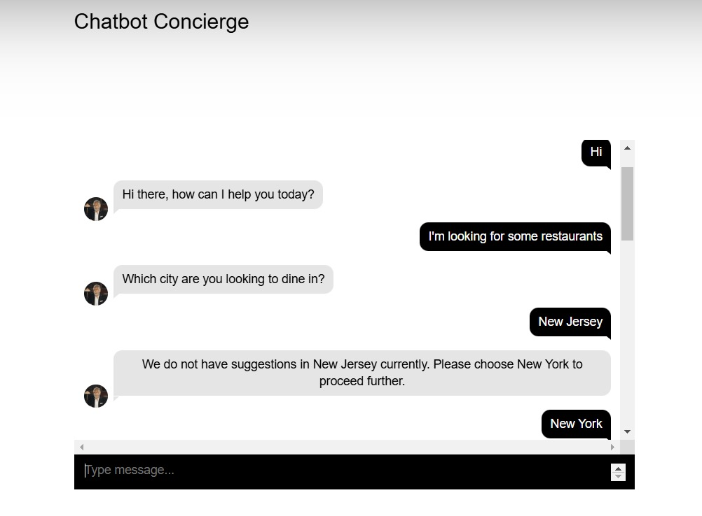
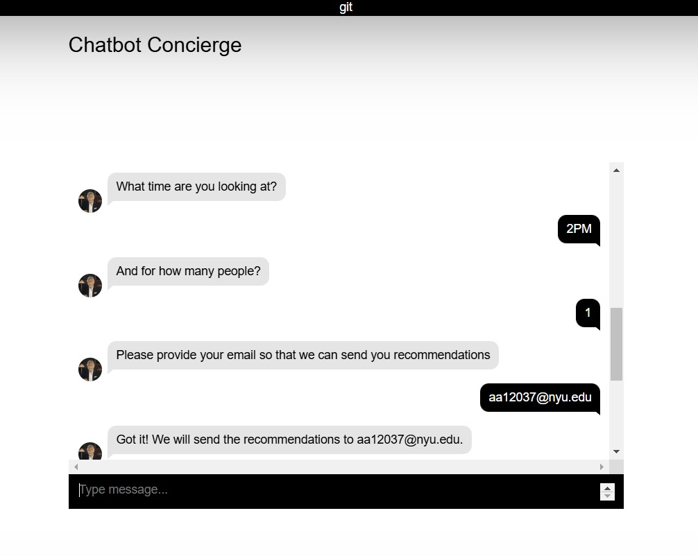

# Cloud Computing and Big Data( Spring 2025) - Homework Assignment 1
# Dining Concierge Chatbot - AWS Serverless Application

## Overview
This repository contains code for a serverless, microservice-driven web application built on AWS. The Dining Concierge chatbot helps users find restaurant suggestions based on their preferences through a conversational interface.

**Collaborators: Abhishek Adinarayanappa (aa12037), Adithya Balachandra (ab12095)**

## Architecture

The application leverages several AWS services in a serverless architecture:
- **S3**: Hosts the frontend web application
- **API Gateway**: Manages the API endpoints
- **Lambda Functions**: Handles backend logic (LF0, LF1, LF2)
- **Amazon Lex**: Powers the natural language processing chatbot
- **SQS**: Message queue for decoupling chatbot and suggestion service
- **ElasticSearch**: Indexes restaurant data for quick cuisine-based queries
- **DynamoDB**: Stores detailed restaurant information
- **SES**: Sends email recommendations to users
- **CloudWatch/EventBridge**: Triggers the suggestion service periodically

## Features
- Interactive chatbot interface that collects dining preferences
- Restaurant data collection from Yelp API 
- Personalized restaurant recommendations via email
- Serverless architecture for scalability and low maintenance

## Components

### Frontend
- Single-page web application hosted on S3
- Communicates with backend through API Gateway

### Backend Services
1. **API Gateway + Lambda (LF0)**
   - Handles API requests from frontend
   - Communicates with Lex chatbot

2. **Lex Chatbot + Lambda (LF1)**
   - Processes natural language inputs
   - Implements conversation flow with intents:
     - GreetingIntent
     - ThankYouIntent
     - DiningSuggestionsIntent
   - Collects user preferences (location, cuisine, time, party size, email)
   - Sends collected data to SQS

3. **Restaurant Data Collection**
   - Collects restaurant data from Yelp API
   - Stores in DynamoDB with restaurant details
   - Indexes in ElasticSearch for cuisine-based search

4. **Recommendation Service (LF2)**
   - Triggered by CloudWatch/EventBridge
   - Processes messages from SQS
   - Queries ElasticSearch for restaurants by cuisine
   - Fetches detailed information from DynamoDB
   - Formats and sends recommendations via SES

## Setup Instructions

### Prerequisites
- AWS Account with permissions for all required services
- AWS CLI configured with appropriate credentials
- Node.js and npm installed

### Example Conversation Flow

